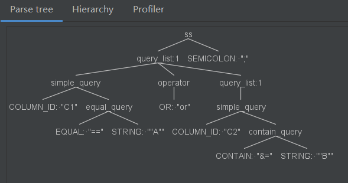
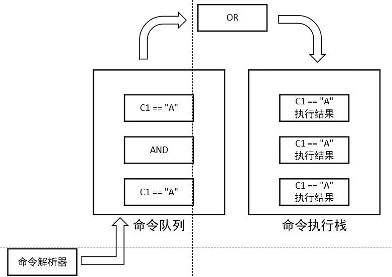

# ServerS
#### Author : Yi Wu
#### E-mail : yiwu@nuaa.edu.cn  

## 1.介绍  
通过HTTP服务编写一个API server。支持通过简单的命令实现对csv数据表的查询操作。项目GIT:[https://github.com/username123wy/ServerS](https://github.com/username123wy/ServerS)  
## 2.可行性分析 
实现一个小型的csv数据库，通过命令行操作，数据文件只针对csv文件，并通过HTTP服务访问。选用java实现

- csv存储数据：java有很多支持csv文件操作的工具。
- 命令行解析：题目要求的命令较为简单，基本的字符串解析处理，编译原理课程基础。同时java有很多词法分析，语法分析生成器，可以自动根据语法生成编译前端，自动生成关于命令的抽象语法树。
- HTTP服务访问：java支持通过套接字编程实现基本的HTTP服务。  

综上，初步分析，项目可行。

## 2.需求分析  
首先，整个项目主要分为三个部分的需求：1) 通过HTTP访问。2) 通过命令操作。3) 根据命令内容操作csv数据表。  
### 2.1 通过HTTP访问(HTTP-Server) 
以题目的基本要求为主，通过HTTP服务获取命令，并执行命令，并将命令执行结果通过HTTP服务返回。  
### 2.2 通过命令操作(CMD-Control)  
通过命令操作，从HTTP服务处获取用户命令，解析命令，根据命令内容进行csv文件操作。题目的基本要求为查询操作。  
### 2.3 操作csv文件(CSV-Manager)
能够读取csv文件并支持基本的增，删，改，查功能，题目的主要要求以读取为主。  

## 3.项目设计与实现  
### 3.1 HTTP访问  
使用java内置的套接字接口实现从HTTP服务中获取命令。绑定端口为localhost:8800，主要操作代码如下：
```
//1.建立一个服务器Socket(ServerSocket)绑定指定端口
ServerSocket serverSocket=new ServerSocket(8800);
//2.使用accept()方法阻止等待监听，获得新连接
Socket socket=serverSocket.accept();
....
```  
**完整代码将在附录1中给出，代码对应位置**`ServerS\src\main\java\cn\edu\nuaa\little1\http\HttpServer.java`  
### 3.2 通过命令操作  
本文借助工具Antlr4实现命令编译前端的实现，设计命令的抽象语法，并借助Antlr4工具实现了命令词法分析器和语法分析器的生成，并得到抽象语法树，基于抽象语法树，实现命令操作。  
#### 3.2.1 编译前端
Antlr4工具pom.xml配置如下：
```
        <!-- https://mvnrepository.com/artifact/org.antlr/antlr4 -->
        <dependency>
            <groupId>org.antlr</groupId>
            <artifactId>antlr4</artifactId>
            <version>4.8-1</version>
        </dependency>
        <!-- https://mvnrepository.com/artifact/org.antlr/antlr4-runtime -->
        <dependency>
            <groupId>org.antlr</groupId>
            <artifactId>antlr4-runtime</artifactId>
            <version>4.8-1</version>
        </dependency>
```  
对命令进行分析，获得抽象语法，并使用bnf进行表示，为了便于介绍，将本文使用的命令成为ss语言，ss语法详细介绍如下。
```
//首先，ss语言由很多条命令组成，每条命令以分号';'结尾。(SEMICOLON表示分号';')
ss : (query_list SEMICOLON)*;

//其次，命令由简单命令(simple_query)和带有and/or操作符(operator)的复合命令组成。
query_list : simple_query (operator query_list)*;

/*简单命令主要包含相等(equal_query)，
不相等(not_equal_query)，
大小写不敏感的相等(case_insensitive_equal_query)，
包含(contain_query)四种命令。
每个命令都是二元运算符，
并且第一个参数为行号(COLUMN_ID)或者全部(ALL_COLUMNS)。*/
simple_query :(COLUMN_ID | ALL_COLUMNS)
     ( equal_query
     | not_equal_query
     | case_insensitive_equal_query
     | contain_query );

//题目要求操作符 and，or。
operator : AND | OR;

//相等(equal_query): 命令格式为:COLUMN_ID/ALL_COLUMNS == STRING。STRING表示任意字符串。
equal_query :  EQUAL STRING;

//不相等(equal_query): 命令格式为：COLUMN_ID/ALL_COLUMNS != STRING。
not_equal_query : NOT_EQUAL STRING;

//大小写敏感的相等(case_insensitive_equal_query ):命令格式为：COLUMN_ID/ALL_COLUMNS $= STRING。
case_insensitive_equal_query : CASE_EQUAL STRING;

//包含(contain_query):命令格式为COLUMN_ID/ALL_COLUMNS &= STRING。
contain_query : CONTAIN STRING;
```   
**完整代码将在附录2中给出，代码对应位置**`ServerS\src\main\java\cn\edu\nuaa\little1\grammer\SS.g4`  

#### 3.2.2 编译后端  
通过Antlr4的帮助，获取抽象语法树。为命令创建对应的数据结构。由于时间比较仓促，创建了一个较为简单中间结构。主要分为两层，顶层抽象和底层实现。

顶层抽象主要包括一个接口和两个抽象类(`Item`，`Operator`和`Query`)。
```
//Item顶层抽象接口，命令的中间数据结构使用的类都实现这个接口。
public interface Item {
    public Object execute(Object input);
}

//操作符抽象类：用来执行命令中and / or实现的操作。
public abstract class Operator implements Item {
    ......
    public abstract List<String> opExecute(List<String> columns1,List<String> columns2);
    ......
}

//命令抽象类：四种命令将继承这个抽象类。
public abstract class Query implements Item {
    protected Column column;
    protected Content content;
    ......
}
```   

`Item`的子类主要负责组成一个命令的基本元素，主要包括列(`Column`)，查询内容(`Content`)。
```
//列：主要用来保存命令操作的csv文件列号。
public class Column implements Item {
    private String ID; //列号
    ......
}  

//查询内容：主要用来保存命令查询的字符串
public class Content implements Item {
    private String content; //查询内容
    ......
}

```  

`Operator`的子类主要负责and和or操作符的具体实现。
```
//And操作符，主要负责将两次简单命令的结果进行and运算。
public class AndOperator extends Operator {
    @Override
    public List<String> opExecute(List<String> columns1, List<String> columns2) {
        ......
    }
}
//Or操作符，主要负责将两次简单命令的结果进行or运算
public class OrOperator extends Operator {
    @Override
    public List<String> opExecute(List<String> columns1, List<String> columns2) {
        ......
    }
}
```  

`Query`的子类主要负责四种简单命令的实现。
```
//等于命令
public class EqualQuery extends Query {
    @Override
    public List<String> operatorExecute(List<List<String>> columns) {
    ......
    }
}
不等于命令NotEqualQuery，
大小写敏感的等于命令CaseEqualQuery，
包含命令ContainQuery的类结构与上述相同。
```  
编译后端主要是由`Item`，`Operator`和`Query`以及各自的子类组成。  
**上面只给出部分代码，详细代码见附录3，代码对应位置**`ServerS\src\main\java\cn\edu\nuaa\little1\query`  

#### 3.2.3 遍历语法树
3.2.1节通过Antlr4获得输入命令的语法树，3.2.2介绍了用来保存命令相关信息的中间数据结构。本节将介绍遍历语法树并从语法树取出命令的相关信息保存到中间数据结构中的过程。

以命令`C1 == "A" or C2 &= "B"为例，语法树的结构如下：
  
通过深度优先，遍历语法树，并在各个结点获取对应命令信息。图中1标记处为起点2标记处为终点。  
  
图中，每个节点对应“进入节点”和“离开节点”两个箭头。

两个箭头对应到遍历语法树的操作中为`enter...`和`exit...`两个接口。以节点`simple_query`为例。
```
//进入simple_query节点箭头
 @Override
    public void enterSimple_query(SSParser.Simple_queryContext ctx) {
    //实现进入该节点时的操作
     ......
    }

//离开simple_query节点箭头
@Override
    public void exitSimple_query(SSParser.Simple_queryContext ctx) {
    //实现离开该节点时的操作
     ......
    }
```  
**上面只给出部分代码，详细代码见附录4，代码对应位置**`ServerS\src\main\java\cn\edu\nuaa\little1\walker\SSActioner.java`   

### 3.3 操作CSV文件  
本文通过java工具`opencsv`将进行csv文件的读取。

工具pom.xml配置。
```
 <!-- https://mvnrepository.com/artifact/com.opencsv/opencsv -->
        <dependency>
            <groupId>com.opencsv</groupId>
            <artifactId>opencsv</artifactId>
            <version>5.2</version>
        </dependency>
```  

#### 3.3.1 文件内容读取
通过工具读取CSV文件，并将文件内容保存在二维list中，这一部分代码单纯在使用API，内容不做赘述。
**详细代码见附录5，代码对应位置。**`ServerS\src\main\java\cn\edu\nuaa\little1\file\CSVFileHandler.java`  

#### 3.3.2 输出内容计算  
ServerS工具的主要输出是符合条件的CSV行，因此，本文在中间计算的过程中使用行号`row_id`作为不同计算过程中的传递参数。

计算过程草图图下(没有时间了，详细过程后续会在Github上进行更新)：  
  

计算算法的步骤如下：

- 首先，通过命令解析模块获取用户输入命令，并将命令保存在命令队列中。  

- 队列不为空，循环出队，如果出队的是简单命令，不是操作符`AND / OR`。就将简单命令执行，并将执行结果入栈。  

- 如果是操作符，就进行一次出栈操作和一次出队操作，并将出队的命令与出栈的命令分别执行，两个执行结果，根据操作符进行AND或者OR操作。并将操作结果入栈。

- 当队列为空时，将栈全部结果出栈，并输出。  
- 
**详细代码见附录6，代码对应位置。**`ServerS\src\main\java\cn\edu\nuaa\little1\query\QueryManager.java`                                              

## 4.运行测试  
由于业务能力有限，未能在规定时间内进行完整的测试过程，只是用了小部分测试用例，保证题目要求的基本流程正常进行。测试通过的测试用例如下：

CSV文件：
```
用例1：题目用例
C1,C2,C3,C1
A,Another “Sample”,Value 1,DD
Sample Text 2,Another “Sample” 2,Value 2,C1

用例2：编写用例
C1,c1,sample,name,ID,89iu
A1,a1,"string","String",88,"I like eating fish"
"string",B3,B4,aa55,“电脑”，“游泳”
"string","string",,,DDDD

```  

测试命令与运行结果,一共10条命令，这里展示3条。
**其他命令测试用例所在位置。**`ServerS\src\main\resources` 

```
C1 == "A" or C2 &= "B"
```

```
C1 == "Test" and * $= "Prod" and * != "Hidden"
```

```
C1 &= "string" or * $= "Prod" or * != "Hidden";
```  
运行结果
```
C1 == "A" or C2 &= "B"
//使用用例1 csv文件，没有符合条件的命令
[]
```

```
C1 == "Test" and * $= "Prod" and * != "Hidden"
//使用用例1 csv文件，没有符合条件的命令
[]
```

```
C1 &= "string" or * $= "Prod" or * != "Hidden";
//使用用例2 csv文件，两行数据符合命令
[C1, c1, sample, name, ID, 89iu]
[string, B3, B4, aa55, “电脑”，“游泳”]
[string, string, , , DDDD]
``` 

## 5.总结  
由于业务能力有限，未能在规定时间内开发出可上线的完整版本，提交版ServerS中完成了题目要求的主要流程，即通过HTTP服务获取命令，解析命令，操作CSV文件，将CSV文件操作结果通过HTTP命令返回。由于工具没有经过完整的审查与测试过程，仍然存在很多问题，主要问题如下：
  
  - 关于CSV文件中的引号问题，由于使用java工具openCSV，openCSV不支持引号的直接读取，在使用的CSV文件中包含引号可能会出现问题。后续工作希望通过Antlr4开发，由于时间限制，没有完成。

  - 关于Anltr4解析CSV的语法已经写完，文件位置`ServerS\src\main\java\cn\edu\nuaa\little1\grammer\CS`。  
  
  - 对软件测试过程不够，仍然存在很多问题，没有发现。
  - 命令解析过程的错误信息目前只能在HTTP服务端输出，没有生成对应的日志文件。由于时间问题没顾上添加日志管理。

## 6.附录

### 附录 1
HttpServer
```
public class HttpServer {

    public static final String path="项目所在位置\\ServerS\\src\\main\\resources\\test1.csv";
    public static void main(String[] args) {
        try {
            //1.建立一个服务器Socket(ServerSocket)绑定指定端口
            ServerSocket serverSocket=new ServerSocket(8800);
            //2.使用accept()方法阻止等待监听，获得新连接
            Socket socket=serverSocket.accept();
            //3.获得输入流
            InputStream is=socket.getInputStream();
            BufferedReader br=new BufferedReader(new InputStreamReader(is));
            //获得输出流
            OutputStream os=socket.getOutputStream();
            PrintWriter pw=new PrintWriter(os);
            //4.读取用户输入信息
            String cmd=null;
            String reply="";
            while(!((cmd=br.readLine())==null)){
                System.out.println("接受命令:"+cmd);
                reply=ServerS.parse(path,cmd);
            }
            //给客户一个响应
            pw.write(reply);
            pw.flush();
            //5.关闭资源
            pw.close();
            os.close();
            br.close();
            is.close();
            socket.close();
            serverSocket.close();
        } catch (IOException e) {
            e.printStackTrace();
        }
    }
}
```

### 附录 2
SS语言语法 SS.g4
```
grammar SS;

//语法规则

ss : (query_list SEMICOLON)*;

query_list : simple_query (operator query_list)*
            | LEFT_BRACKETS simple_query (operator query_list)* RIGHT_BRACKETS
            ;

simple_query :(COLUMN_ID | ALL_COLUMNS)
     ( equal_query
     | not_equal_query
     | case_insensitive_equal_query
     | contain_query );

operator : AND | OR;

equal_query :  EQUAL STRING  ;

not_equal_query : NOT_EQUAL STRING;

case_insensitive_equal_query : CASE_EQUAL STRING;

contain_query : CONTAIN STRING;

//词法规则
AND : 'and';
OR : 'or';

LEFT_BRACKETS : '(';
RIGHT_BRACKETS : ')';

EQUAL : '==';
NOT_EQUAL : '!=';
CASE_EQUAL : '$=';
CONTAIN : '&=';
SEMICOLON : ';';
QUOTATION : '"';

WS : [ \t\n\r] -> skip;
COMMENT : '#' .*? '\n' -> skip;

STRING :QUOTATION (ESC|.)*? QUOTATION;
//匹配两个引号间的任意文本,并且定义转移字符\"和\\
fragment ESC : '\\' [btnr"\\];

//这个ID一定得放在关键字后面
COLUMN_ID : [a-zA-Z0-9]+;
ALL_COLUMNS : '*';


```

### 附录 3
Item
```
public interface Item {
    public Object execute(Object input);
}
```
Item 实现类Column,Content
```
public class Column implements Item {
    private String ID;
    public String getID(){
        return ID;
    }
    public void setID(String id){
        this.ID=id;
    }

    @Override
    public String execute(Object input) {
     return null;
    }

}

public class Content implements Item {
    private String content;

    public void setContent(String conIn){
        this.content=conIn;
    }

    @Override
    public String execute(Object input) {
        return this.content;
    }

}
```


Operator
```
public abstract class Operator implements Item {
    @Override
    public List<List<String>> execute(Object input) {
        return operatorExecute(null);
    }

    public abstract List<String> opExecute(List<String> columns1,List<String> columns2);

    public abstract List<List<String>> operatorExecute(List<List<String>> columns);

}
```
Operator子类AndOperator, OrOperator
```
public class AndOperator extends Operator {
    @Override
    public List<String> opExecute(List<String> columns1, List<String> columns2) {
        List<String> result=new ArrayList<>();

        result=columns1.stream().filter(s -> columns2.contains(s)).collect(Collectors.toList());
        return result;
    }

    @Override
    public List<List<String>> operatorExecute(List<List<String>> columns) {
       return null;
    }
}

public class OrOperator extends Operator {
    @Override
    public List<String> opExecute(List<String> columns1, List<String> columns2) {
        List<String> result=new ArrayList<>();

        result.addAll(columns1);

        for (String column2:columns2) {
                if((!SetUtils.judgeContainsStr(column2))&&(!result.contains(column2))){
                    result.add(column2);
                }
        }

        return result;
    }

    @Override
    public List<List<String>> operatorExecute(List<List<String>> columns) {
       return null;
    }

}

```
Query
```
public abstract class Query implements Item {
    protected Column column;
    protected Content content;

    public Query(){
        content=new Content();
        column=new Column();
    }
    @Override
    public List<String> execute(Object input) {
        FileHandler file = (FileHandler) input;
        return operatorExecute(file.getColumnByHeader(column.getID()));
    }

    public void setID(String id){
        column.setID(id);
    }

    public void setContent(String contin){
        content.setContent(contin);
    }
    public abstract List<String> operatorExecute(List<List<String>> columns);

}

```
Query 子类EqualQuery,NotEqualQuery,CaseEqualQuery,ContainQuery
```
public class EqualQuery extends Query {
    @Override
    public List<String> operatorExecute(List<List<String>> columns) {
        List<String> result=new ArrayList<String>();

        for (List<String> column:columns) {
            List<String> tmp=new ArrayList<String>();
            tmp.add(column.get(0));
            for (int i=1;i<column.size();i++) {
                if ((!result.contains(String.valueOf(i)))&&content.execute(null).equals(column.get(i))) {
                    result.add(String.valueOf(i));
                }
            }
        }
        return result;
    }
}

public class NotEqualQuery extends Query {
    @Override
    public List<String> operatorExecute(List<List<String>> columns) {
        List<String> result=new ArrayList<String>();

        for (List<String> column:columns) {
            List<String> tmp=new ArrayList<String>();
            tmp.add(column.get(0));
            for (int i=1;i<column.size();i++) {
                if ((!result.contains(String.valueOf(i)))&&!content.execute(null).equals(column.get(i))) {
                    result.add(String.valueOf(i));
                }
            }
        }
        return result;
    }
}

public class CaseEqualQuery extends Query {
    @Override
    public List<String> operatorExecute(List<List<String>> columns) {
        List<String> result=new ArrayList<String>();

        for (List<String> column:columns) {
            List<String> tmp=new ArrayList<String>();
            tmp.add(column.get(0));
            for (int i=1;i<column.size();i++) {
                if ((!result.contains(String.valueOf(i)))&&content.execute(null).equalsIgnoreCase("\""+column.get(i)+"\"")) {
                    result.add(String.valueOf(i));
                }
            }
        }
        return result;
    }
}

public class ContainQuery extends Query {
    @Override
    public List<String> operatorExecute(List<List<String>> columns) {

        List<String> result=new ArrayList<String>();

        for (List<String> column:columns) {
            List<String> tmp=new ArrayList<String>();
            tmp.add(column.get(0));
            for (int i=1;i<column.size();i++) {
                if ((!result.contains(String.valueOf(i)))&&column.get(i).contains(content.execute(null))) {
                    result.add(String.valueOf(i));
                }
            }

        }
        return result;
    }
}
```

### 附录 4
SSActioner
```
public class SSActioner extends SSBaseListener {
    @Override
    public void enterSimple_query(SSParser.Simple_queryContext ctx) {
        super.exitSimple_query(ctx);
        String ID=null;
        String allID=null;
        if(ctx.COLUMN_ID()!=null) {
            ID = ctx.COLUMN_ID().getText();
        }
        if(ctx.ALL_COLUMNS()!=null) {
            allID = ctx.ALL_COLUMNS().getText();
        }
        if(ID!=null) QueryManager.getManager().addID(ID);
        if(allID!=null) QueryManager.getManager().addID(allID);
//        System.out.println(ID+":"+allID);
    }

    private String tmpID="";

    @Override
    public void enterEqual_query(SSParser.Equal_queryContext ctx) {
        super.enterEqual_query(ctx);
        EqualQuery eq =new EqualQuery();
        SSParser.Simple_queryContext sct= (SSParser.Simple_queryContext) ctx.parent;

        if(ctx.STRING()!=null) {
            int length=ctx.STRING().getText().length()-1;
            eq.setContent(ctx.STRING().getText().substring(1,length));
            eq.setID(getID(sct));
        }
        QueryManager.getManager().addCmd(eq);
    }
    private String getID(SSParser.Simple_queryContext sct){
        String ID=null;
        String allID=null;
        if(sct.COLUMN_ID()!=null) {
            ID = sct.COLUMN_ID().getText();
        }
        if(sct.ALL_COLUMNS()!=null) {
            allID = sct.ALL_COLUMNS().getText();
        }
        if(ID!=null) return ID;
        if(allID!=null) return allID;
        return null;
    }

    @Override
    public void enterNot_equal_query(SSParser.Not_equal_queryContext ctx) {
        super.enterNot_equal_query(ctx);
        NotEqualQuery neq =new NotEqualQuery();
        SSParser.Simple_queryContext sct= (SSParser.Simple_queryContext) ctx.parent;

        if(ctx.STRING()!=null) {
            int length=ctx.STRING().getText().length()-1;
            neq.setContent(ctx.STRING().getText().substring(1,length));
            neq.setID(getID(sct));
        }
        QueryManager.getManager().addCmd(neq);
    }

    @Override
    public void enterCase_insensitive_equal_query(SSParser.Case_insensitive_equal_queryContext ctx) {
        super.enterCase_insensitive_equal_query(ctx);
        CaseEqualQuery ceq =new CaseEqualQuery();
        SSParser.Simple_queryContext sct= (SSParser.Simple_queryContext) ctx.parent;

        if(ctx.STRING()!=null) {
            int length=ctx.STRING().getText().length()-1;
            ceq.setContent(ctx.STRING().getText().substring(1,length));
            ceq.setID(getID(sct));
        }
        QueryManager.getManager().addCmd(ceq);
    }

    @Override
    public void enterContain_query(SSParser.Contain_queryContext ctx) {
        super.enterContain_query(ctx);
        ContainQuery cq =new ContainQuery();
        SSParser.Simple_queryContext sct= (SSParser.Simple_queryContext) ctx.parent;

        if(ctx.STRING()!=null) {
            int length=ctx.STRING().getText().length()-1;

            cq.setContent(ctx.STRING().getText().substring(1,length));
            cq.setID(getID(sct));
        }
        QueryManager.getManager().addCmd(cq);
    }

    @Override
    public void enterOperator(SSParser.OperatorContext ctx) {
        super.enterOperator(ctx);
        Operator op=null;
        if(ctx.AND()!=null){
           op=new AndOperator();
           QueryManager.getManager().addCmd(op);
        }
        if(ctx.OR()!=null){
            op=new OrOperator();
            QueryManager.getManager().addCmd(op);
        }
    }
}

```

### 附录 5
CSVFileHandler
```
public class CSVFileHandler implements FileHandler{

    private static FileHandler csvFileHandler = null;
    private CSVFileHandler(){ }
    public static FileHandler getCSVHandler(){
        if(csvFileHandler==null){
            csvFileHandler=new CSVFileHandler();
        }
        return csvFileHandler;
    }

    private List<String[]> csvContent = new ArrayList<String[]>();
    public List<String[]> read(String srcPath) {

        String charset = "utf-8";
        Iterator<String[]> iterator=null;
        try (CSVReader csvReader = new CSVReaderBuilder(new BufferedReader(new InputStreamReader(new FileInputStream(new File(srcPath)), charset))).build()) {
            iterator = csvReader.iterator();
            while (iterator.hasNext()) {
                csvContent.add(iterator.next());
            }
        } catch (Exception e) {
            e.printStackTrace();
        }
        return csvContent;
    }

    public List<List<String>> getColumnByHeader(String header){
        List<List<String>> result =new ArrayList<List<String>>();

        for (int i=0;i<csvContent.get(0).length;i++){
            List<String> temp =new ArrayList<String>();
            if(csvContent.get(0)[i].equals(header)){
                for (String[] column : csvContent) {
                    temp.add(column[i]);
                }
                result.add(temp);
            }
        }
        return result;
    }

}

```
### 附录 6
QueryManager
```
public class QueryManager {
    private static QueryManager Query_Manager=null;
    private QueryManager(Log logIn){
        allInputCommands = new LinkedList<Item>();;
        allColumnID = new ArrayList<String>();
        resultsStk = new Stack<List<String>>();
        log=logIn;
    }

    public static QueryManager getManager(){
        if(Query_Manager==null){
            Query_Manager=new QueryManager(new CmdLog());
        }
        return Query_Manager;
    }
    protected List<String> allColumnID = null;
    protected Queue<Item> allInputCommands = null;
    protected Stack <List<String>> resultsStk = null;

    protected Log log=null;

    public void setLog(Log logIn){
        log=logIn;
    }

    public void addCmd(Item item){
        this.allInputCommands.offer(item);
    }

    public void addID(String ID){
        this.allColumnID.add(ID);
    }

    public List<String> executeAllCmds(){
        List<String> result=null;
        while(!allInputCommands.isEmpty()){
            Item i = allInputCommands.poll();
            result = (List<String>) i.execute(CSVFileHandler.getCSVHandler());
            if(result!=null){
                resultsStk.push(result);
            }else{
                List<String> p1 = resultsStk.pop();
                Item i1=allInputCommands.poll();
                List<String> p2 = (List<String>) i1.execute(CSVFileHandler.getCSVHandler());
                Operator tmpOp= (Operator) i;
                resultsStk.push(tmpOp.opExecute(p1,p2));
            }
        }

        result=new ArrayList<>();
        while(!resultsStk.empty()){
            List<String> tmps=resultsStk.pop();
            for (String tmp:tmps) {
                if(!result.contains(tmp)){
                    result.add(tmp);
                }
            }
        }
        return result;
    }
}

```


